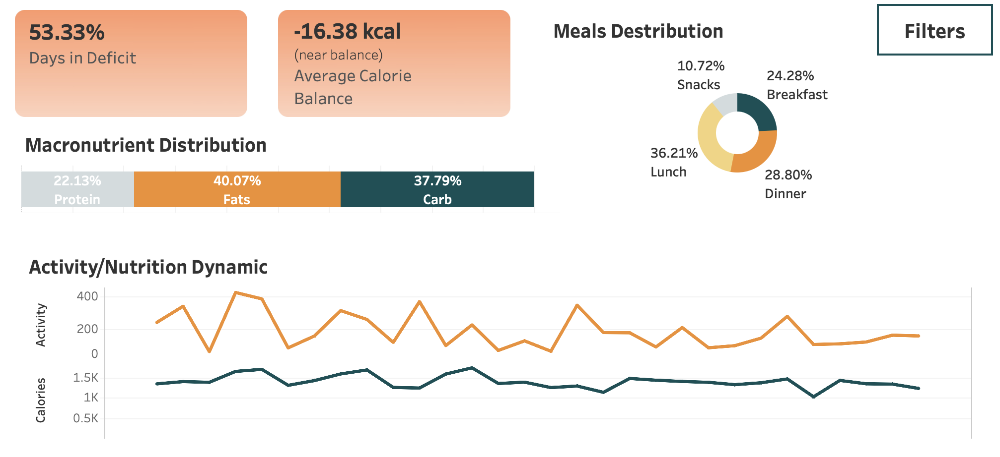
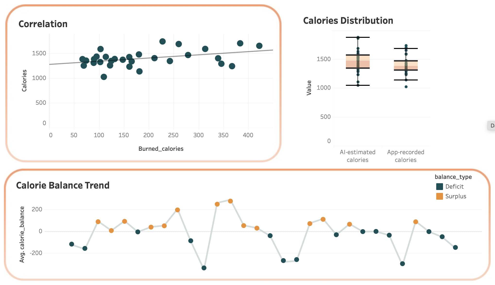

# Аналіз калорійного балансу та активності

## Опис проєкту

Прорєкт демонструє аналіз власних даних щодо харчування та фізичної активністі. 
Мета - дослідити калорійний баланс, структуру розподілу макронутрієнтів та взаємозв’язок між активністю і спожитими калоріями.

Проєкт включає:
- обробку та аналіз даних у Python (Google Colab)
- створення інтерактивного дашборду в Tableau

## Цілі аналізу

- Проаналізувати розподіл макронутрієнтів (білки, жири, вуглеводи)
- Дослідити залежність між фізичною активністю та калорійністю
- Порівняти різні джерела даних (AI vs App)
- Оцінити середній калорійний баланс (дефіцит / профіцит)
- Визначити частку днів із дефіцитом калорій
- Оцінити розподіл спожитих калорій в залежності від дня тижня

## Використані інструменти

- Python (Pandas, NumPy)
- Matplotlib / Seaborn
- Tableau

## Основні інсайти

- Розподіл макронутрієнтів не є збалансованим: жири (близько 40%) перевищують рекомендований діапазон (20-35%)
- Спостерігається слабка позитивна залежність між фізичною активністю та споживанням калорій
- Дані з різних джерел (AI vs App) мають статистично значущі відмінності у розподілі (Типова помилка AI становить приблизно 7–8% від калорійності раціону)
- Середній калорійний баланс знаходиться близько до рівня підтримки, що свідчить про стабільне харчування (середній калорійний баланс -16 ккал)
- Більше половини днів спостерігається дефіцит калорій (дні в дефіциті 53%)
- Споживання калорій зростає у вихідні (субота–неділя), що може пояснювати збільшення кількості профіцитних днів.

*English version*

# Calorie Balance and Activity Analysis

## Project Overview

This project demonstrates the analysis of personal nutrition and physical activity data.  
The goal is to explore calorie balance, macronutrient distribution, and the relationship between physical activity and calorie intake.

The project includes:
- data processing and analysis in Python (Google Colab)
- creation of an interactive dashboard in Tableau

## Analysis Goals

- Analyze macronutrient distribution (proteins, fats, carbs)
- Explore the relationship between physical activity and calorie intake
- Compare different data sources (AI vs App)
- Evaluate average calorie balance (deficit / surplus)
- Determine the share of days in a calorie deficit
- Analyze calorie intake distribution by day of the week

## Tools Used

- Python (Pandas, NumPy)
- Matplotlib / Seaborn
- Tableau

## Key Insights

- Macronutrient distribution is not balanced: fat intake (40%) exceeds the recommended range (20–35%)
- A weak positive correlation is observed between physical activity and calorie intake
- Data from different sources (AI vs App) show statistically significant differences in distribution (typical AI error is approximately 7–8% of total calorie intake)
- The average calorie balance is close to maintenance level, indicating relatively stable eating habits (average balance: -16 kcal)
- More than half of the days are in a calorie deficit (53% of days)
- Calorie intake increases on weekends (Saturday–Sunday), which may contribute to a higher number of surplus days
